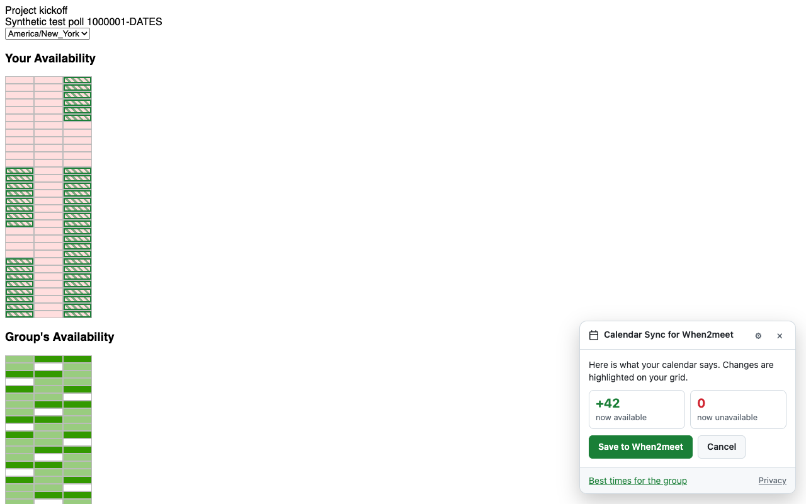

# Calendar Sync for When2meet

Fill your [When2meet](https://www.when2meet.com) availability from **Google Calendar**, **Outlook / Microsoft 365**, or **any calendar link** (Apple iCloud, Proton, Fastmail, Nextcloud, …) in one click.

<p align="center">
  
</p>

> Unofficial and independent. Not affiliated with When2meet, Google or Microsoft.

## What it does

- **One click per poll.** Open any When2meet link and click **Fill from my calendar**. The extension signs in with your name, works out when you're free, and highlights the changes on your grid. Save, and the result is checked against When2meet's server. Undo is one click.
- **Every calendar you use, together.** Connect several Google and Microsoft accounts and calendar links; their busy times are merged.
- **Updates when your calendar changes.** Reopen a poll you filled and you'll be told if your calendar changed, with a one-click update. Slots you changed by hand are kept.
- **Your rules.** Buffers around meetings, working hours, minimum free stretch, and how to treat tentative, out-of-office, working-elsewhere and all-day events.
- **Term-long polls.** Polls that span many weeks, such as a whole term, work the same way. Weekly classes keep their local time across clock changes, and the preview shows the dates covered.
- **Days-of-the-week polls.** Pick which real week to read (next week by default).
- **Best times.** See the windows that work for the most people and add one to Google Calendar, Outlook or any calendar (.ics), with no write access to your calendar.
- **Private by design.** Calendars are read in your browser with read-only, least-privilege access (Google free/busy only). Only the slots you save, and your name, go to When2meet. No analytics. See [PRIVACY.md](docs/PRIVACY.md).

| Calendar | How it connects |
|---|---|
| Google Calendar | One-click sign-in (`calendar.freebusy`), or a secret iCal link |
| Outlook / Microsoft 365 | One-click sign-in (`Calendars.ReadBasic`), or a published "busy only" link |
| Apple iCloud, Proton, Fastmail, Yahoo, Nextcloud, … | Calendar link (`webcal://` / `https://…ics`) — [how to find it](docs/CALENDAR_LINKS.md) |
| Anything else | Import an `.ics` file |

## Install

The extension is being prepared for the Chrome Web Store, Firefox Add-ons and Edge Add-ons. Until then:

1. Download the zip for your browser from the [latest release](https://github.com/jxmils/when2meet/releases/latest), or build it (below).
2. **Chrome / Edge:** open `chrome://extensions` (or `edge://extensions`), turn on Developer mode, and *Load unpacked* the unzipped folder.
   **Firefox:** open `about:debugging#/runtime/this-firefox` → *Load Temporary Add-on* → pick `manifest.json`.
3. The settings page opens. Enter your name and connect a calendar.

Builds without OAuth credentials still work with calendar links and `.ics` files.

## How it works

```
 when2meet.com tab                         extension background
 ┌──────────────────────────────┐          ┌─────────────────────────────────────────┐
 │ page script (page's own JS)  │◀────────▶│ sign-in: Google (via broker), Microsoft │
 │  reads the grid, signs in,   │          │ calendars: free/busy, Graph, ICS        │
 │  saves, verifies via reload  │          │ engine: busy → rules → slot bits → plan │
 │ panel (shadow DOM, Preact)   │◀────────▶│ storage: settings, per-poll records     │
 └──────────────────────────────┘          └─────────────────────────────────────────┘
```

When2meet has no API, so the extension works the way you would: it reads the poll page, signs in through the page's form, and saves with the same request the page sends when you drag across the grid (at most two requests per fill). Every save is verified with a fresh, uncached reload of the poll; if When2meet didn't keep it, the extension replays the change through the page's own grid handler. Details: [ARCHITECTURE.md](docs/ARCHITECTURE.md) and [WHEN2MEET_INTERNALS.md](docs/WHEN2MEET_INTERNALS.md).

## Develop

Requires Node.js 24 (see `.nvmrc`).

```bash
npm install
npm test                 # unit tests (core engine, When2meet adapter, providers, broker)
npm run e2e              # builds the extension and drives it in Chromium against a mock When2meet
npm run dev              # Chrome with the extension loaded and hot reload
npm run dev:firefox      # Firefox
npm run build:all        # Chrome, Edge and Firefox builds in apps/extension/.output/
npm run mock             # local mock When2meet at http://localhost:8787 (use with W2M_DEV_HOSTS=1)
```

One-click sign-in needs your own OAuth apps: copy `apps/extension/.env.example` to `apps/extension/.env` and follow [SETUP_GOOGLE.md](docs/SETUP_GOOGLE.md) and [SETUP_MICROSOFT.md](docs/SETUP_MICROSOFT.md).

### Repository layout

| Path | What's there |
|---|---|
| `packages/core` | Pure availability engine: slot mapping (incl. DST and days-of-week polls), busy rules, fill planning with manual-edit tracking, best times, calendar links, `.ics` export |
| `packages/when2meet` | When2meet adapter: page parsing, sign-in, save strategies with server verification, synthetic test pages |
| `packages/providers` | Google free/busy, Microsoft Graph `calendarView`, ICS parsing (recurrences, exceptions, Windows timezones) |
| `apps/extension` | The WXT browser extension (background, content panel, page script, settings) |
| `apps/web` | Cloudflare Worker: stateless Google OAuth broker and the project website (privacy policy, terms) |
| `tools/mock-when2meet` | In-memory mock of When2meet for tests and local development |
| `tools/canary` | Weekly read-only check that When2meet still looks the way the extension expects |
| `e2e` | Playwright end-to-end tests |
| `docs` | Architecture, setup, publishing and privacy documentation |

## Roadmap

- [x] Core engine, When2meet adapter, ICS/Google/Microsoft providers, extension, OAuth broker, e2e tests
- [x] Live verification against real When2meet polls ([results](docs/WHEN2MEET_INTERNALS.md#live-verification))
- [ ] Store listings (Chrome Web Store, Firefox Add-ons, Edge Add-ons); Google OAuth verification
- [ ] No-install web app at `https://<site>/?<poll>` for phones and Safari (server-side saving is confirmed to work)
- [ ] Safari extension

## Contributing

Issues and pull requests are welcome; see [CONTRIBUTING.md](CONTRIBUTING.md). Report security issues privately as described in [SECURITY.md](SECURITY.md).

## License

[MIT](LICENSE). When2meet is a trademark of its owner; this project is not affiliated with it.
